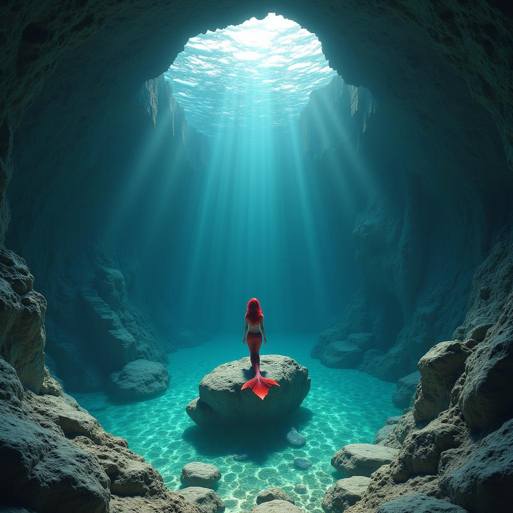
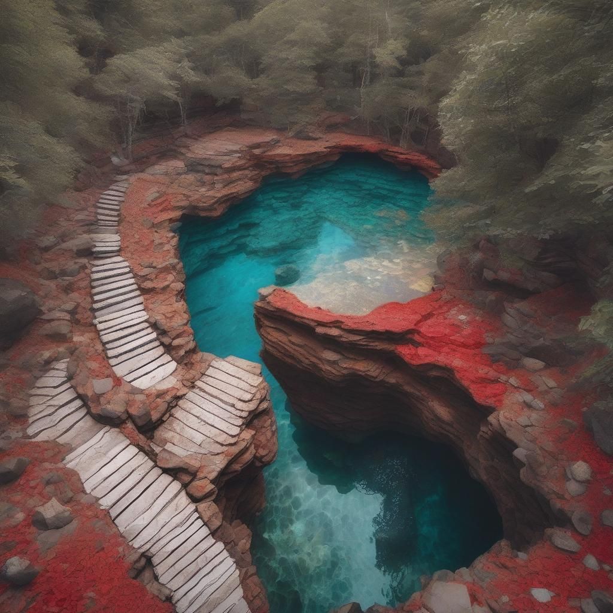

# 🖼️ Image_Generation_Project

This project demonstrates **image generation using AI models**.  
It includes a simple implementation to generate and experiment with images from prompts or fine-tuned models. 🚀

---

## 🔹 Features
- Generate images from text prompts.
- Easy-to-use and extendable code structure.
- Jupyter Notebook for experimentation.
- Requirements included for easy setup.

---

## 📸 Sample Outputs

### Example 1: Mermaid in a Cave


### Example 2: Generated Landscape 


---

## 🔧 Installation
Clone the repository and install dependencies:

```bash
git clone https://github.com/your-username/Image_Generation_Project.git
cd Image_Generation_Project
pip install -r requirements.txt
```

---

## 📂 Project Structure

```
Image_Generation_Project/
│── README.md
│── requirements.txt
│── .gitignore
│── images/
│   ├── download.png
│   ├── download2.png
```

---

## 🤝 Contributing
Pull requests are welcome! For major changes, please open an issue first to discuss what you’d like to improve.,

---

## 📜 License
This project is licensed under the MIT License.
